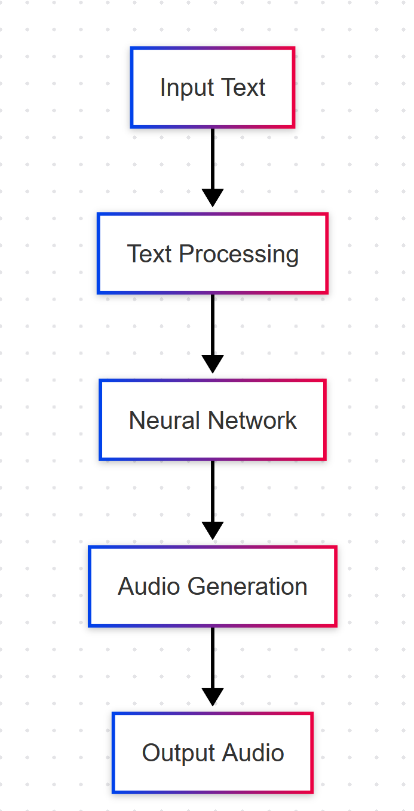
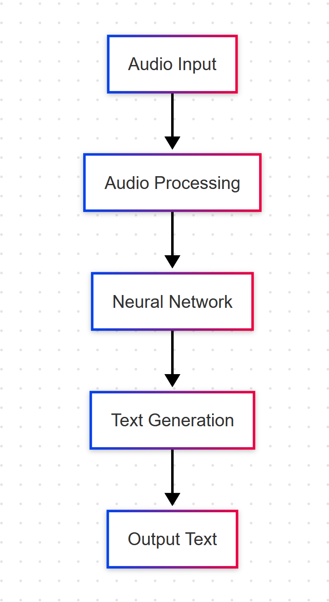

# Google Cloud Speech APIs
## Text-to-Speech & Speech-to-Text
### Sviatoslav Bidzilia MI-41
---

# Overview

- **Text-to-Speech (TTS)**
  - Converts text into natural-sounding speech
  - Uses advanced neural networks
  - Supports multiple languages and voices

- **Speech-to-Text (STT)**
  - Converts audio into text
  - Real-time and batch processing
  - High accuracy with machine learning

---

# Text-to-Speech API Architecture

- **Input Processing**
  - Text normalization
  - SSML support
  - Language detection

- **Neural Network**
  - WaveNet technology
  - Neural vocoder
  - Prosody modeling

---

# Speech-to-Text API Architecture



- **Audio Processing**
  - Noise reduction
  - Audio format conversion
  - Channel separation

- **Neural Network**
  - Deep learning models
  - Context awareness
  - Language adaptation

---

# Key Features

<div class="columns">
<div>

## Text-to-Speech
- Multiple voice types
- Custom voice creation
- SSML support
- Audio format options
- Speaking rate control
- Pitch adjustment

</div>
<div>

## Speech-to-Text
- Real-time streaming
- Batch processing
- Speaker diarization
- Word-level confidence
- Punctuation
- Multiple channel support

</div>
</div>

---

# Supported Languages
<div class="columns">
<div>

## Text-to-Speech
  - 50+ languages
  - 200+ voices
  - Neural voices available
  - Custom voice training
</div>
<div>

## Speech-to-Text
  - 125+ languages
  - Regional variants
  - Automatic language detection
  - Multi-language support

</div>
</div>

---

# Use Cases
<div class="columns">
<div>

1. **Accessibility**
   - Screen readers
   - Voice assistants
   - Audio books

2. **Customer Service**
   - IVR systems
   - Call center analytics
   - Voice bots

</div>
<div>

3. **Content Creation**
   - Podcasts
   - Video narration
   - E-learning

4. **Transcription**
   - Meeting notes
   - Interviews
   - Media subtitles

</div>
</div>

---

# Integration Example

```python
# Text-to-Speech
from google.cloud import texttospeech
client = texttospeech.TextToSpeechClient()
voice = texttospeech.VoiceSelectionParams(
    language_code="en-US",
    name="en-US-Neural2-F"
)
audio_config = texttospeech.AudioConfig(
    audio_encoding=texttospeech.AudioEncoding.LINEAR16
)

# Speech-to-Text
from google.cloud import speech
client = speech.SpeechClient()
config = speech.RecognitionConfig(
    encoding=speech.RecognitionConfig.AudioEncoding.LINEAR16,
    sample_rate_hertz=16000,
    language_code="en-US"
)
```

---

# Best Practices
<div class="columns">
<div>

1. **Text-to-Speech**
   - Use SSML for better control
   - Choose appropriate voice
   - Optimize audio settings
   - Handle rate limits
</div>
<div>

2. **Speech-to-Text**
   - Use appropriate audio format
   - Set correct sample rate
   - Enable word confidence
   - Handle streaming properly
</div>
</div>

---

# Pricing

<div class="columns">
<div>

- **Text-to-Speech**
  - Pay per character
  - Free tier available
  - Different rates for voices
  - Neural voices premium
</div>
<div>

- **Speech-to-Text**
  - Pay per 15 seconds
  - Free tier available
  - Different rates for features
  - Batch processing discounts

</div>
</div>

---

# Future Developments

<div class="columns">
<div>

1. **Text-to-Speech**
   - More natural voices
   - Emotional speech
   - Better prosody
   - Custom voice cloning

</div>
<div>

2. **Speech-to-Text**
   - Better accuracy
   - More languages
   - Real-time translation
   - Context understanding

</div>
</div>

---

# Questions?

Contact:
- Google Cloud Documentation
- API Reference
- Support Channels
- Community Forums 